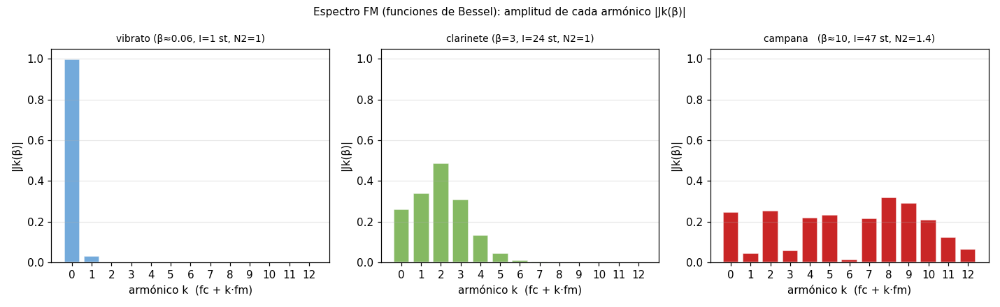
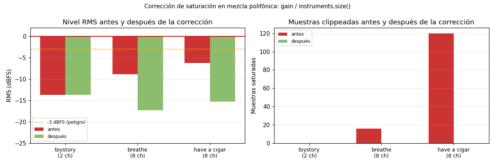

PAV - P5: Síntesis musical polifónica
=====================================

Memoria de la práctica P5 — sintetizador musical polifónico en C++11.  
Compilar con `make release` (instala `synth` en `~/PAV/bin/`).

---

Índice
------
1. [Arquitectura del sistema](#arquitectura-del-sistema)
2. [Envolvente ADSR](#envolvente-adsr)
3. [Síntesis por tabla y muestreo](#síntesis-por-tabla-y-muestreo)
   - [InstrumentDumb](#instrumentdumb-el-instrumento-original)
   - [Instrumento Seno](#instrumento-seno)
   - [InstrumentWavetable](#instrumentwavetable-tabla-externa)
   - [InstrumentSampler](#instrumentsampler-nota-completa)
4. [Efectos sonoros](#efectos-sonoros)
   - [Trémolo](#trémolo)
   - [Vibrato (como efecto)](#vibrato-como-efecto)
   - [Efectos adicionales](#efectos-adicionales-implementados)
5. [Síntesis FM](#síntesis-fm)
   - [InstrumentVibrato](#instrumentvibrato-vibrato-nativo)
   - [InstrumentFM (Chowning)](#instrumentfm-síntesis-fm-de-chowning)
6. [Orquestación](#orquestación-usando-el-programa-synth)
   - [You've Got a Friend in Me](#youve-got-a-friend-in-me--randy-newman)
   - [Breathe (In the Air)](#breathe-in-the-air--pink-floyd)
   - [Have a Cigar](#have-a-cigar--pink-floyd)
   - [Corrección de saturación](#corrección-de-saturación-en-mezcla-polifónica)

---


## Arquitectura del sistema

El programa `synth` sintetiza audio polifónico a partir de tres ficheros de texto:

| Fichero | Función |
|---|---|
| **instruments** (`.orc`) | Define qué instrumento C++ escucha cada canal MIDI y sus parámetros (ADSR, tablas, ratios FM…) |
| **effects** (`.orc` con `-e`) | Define los efectos disponibles (Trémolo, Vibrato, Distortion…) y sus parámetros |
| **score** (`.sco`) | Secuencia de eventos MIDI en tiempo relativo (ticks): NoteOn (9), NoteOff (8), EffectControl (12) |

El bucle principal en `synthesizer.cpp` avanza en el tiempo según los ticks de la partitura. Por cada bloque de `BSIZE = 32` muestras (≈ 0.7 ms a 44 100 Hz), el orquestador (`Orchest`) invoca a todos los instrumentos activos, suma sus salidas, aplica los efectos asignados a cada canal y escala el resultado con la ganancia de mezcla antes de escribir el WAV.

```
score.sco ──▶ Sequencer ──▶ Orchest::command()  ──▶  InstrumentMN (polifonía)
                    │                                       │
                    └──▶ Orchest::synthesize()  ◀──  Instrument::synthesize()
                                │                           │
                           Effect()(xr) ──────────────────▶│
                                │
                           gain / N_instruments
                                │
                           sf_writef_float ──▶ output.wav
```

El parámetro de **ganancia** (`-g`) se normaliza automáticamente por el número de instrumentos registrados (`N`), de modo que la suma de `N` instrumentos a plena amplitud nunca supera ±1.0 (véase §6.4).


## Envolvente ADSR

La envolvente ADSR modula la amplitud de cada nota a lo largo de cuatro fases:

| Fase | Parámetro | Descripción |
|---|---|---|
| **Attack** | `ADSR_A` (s) | Tiempo desde el NoteOn hasta la amplitud máxima (1.0) |
| **Decay** | `ADSR_D` (s) | Tiempo desde el máximo hasta el nivel de sustain |
| **Sustain** | `ADSR_S` (0–1) | Nivel de amplitud mantenido mientras la tecla está pulsada |
| **Release** | `ADSR_R` (s) | Tiempo de decaída a cero tras el NoteOff |

Hemos generado cuatro configuraciones sobre el instrumento `Seno` para ilustrar los distintos comportamientos. Los ficheros `.orc`, `.sco` y `.wav` están en [`work/adsr/`](work/adsr/).

### 1. ADSR genérico

Todos los parámetros bien separados y visibles: ataque lento (0.5 s), caída marcada, sustain al 40 % y release largo.

```text
Seno  ADSR_A=0.5; ADSR_D=0.4; ADSR_S=0.4; ADSR_R=0.6; N=1024;
synth work/adsr/generic.orc work/adsr/long_note.sco work/adsr/generic.wav
```


Las líneas punteadas marcan los límites entre fases: el ataque alcanza el máximo a los 0.5 s, la caída baja hasta S=0.4 a los 0.9 s, el mantenimiento se prolonga hasta el NoteOff a los 3 s, y el release termina 0.6 s después.

### 2. Instrumento percusivo — nota mantenida hasta su extinción

ADSR típico de piano/guitarra: ataque casi instantáneo, caída lenta hasta 0 (S=0), sin fase de sustain, release muy corto.

```text
Seno  ADSR_A=0.005; ADSR_D=1.5; ADSR_S=0; ADSR_R=0.05;
synth work/adsr/percussive.orc work/adsr/percussive_full.sco work/adsr/percussive_full.wav
```


Al llegar al NoteOff la ADSR ya ha llegado a cero: la nota se ha extinguido sola antes de que el intérprete suelte la tecla.

### 3. Instrumento percusivo — nota cortada antes de extinguirse

El mismo instrumento con un NoteOff temprano (a los 0.3 s). El sonido todavía está en la fase de decay cuando se inicia el release, que lo lleva abruptamente a cero en 0.05 s.

```text
synth work/adsr/percussive.orc work/adsr/percussive_cut.sco work/adsr/percussive_cut.wav
```


### 4. Instrumento plano (cuerda frotada / viento)

Ataque rápido, decay casi nulo, sustain alto y constante, release breve. Modela instrumentos de viento o cuerda frotada donde el sonido es estable mientras el intérprete ejecuta la nota.

```text
Seno  ADSR_A=0.08; ADSR_D=0.05; ADSR_S=0.85; ADSR_R=0.12;
synth work/adsr/plain.orc work/adsr/long_note.sco work/adsr/plain.wav
```


## Síntesis por tabla y muestreo

### InstrumentDumb — el instrumento original

`InstrumentDumb` almacena un periodo de sinusoide en una tabla de `N` muestras y la recorre **de uno en uno** con independencia del pitch de la nota. Esto provoca que todas las notas suenen a la misma frecuencia (la frecuencia de muestreo dividida por N), de ahí su nombre.

```cpp
// InstrumentDumb::synthesize() — recorrido fijo, sin pitch correction
for (unsigned int i = 0; i < x.size(); ++i) {
    x[i] = A * tbl[index++];
    if (index == tbl.size()) index = 0;
}
```

El instrumento sirve como referencia de partida para entender la interfaz (constructor, `command()`, `synthesize()`) y el ciclo de vida de una nota ADSR.

### Instrumento Seno

`Seno` corrige los dos defectos de `InstrumentDumb`:

1. **Pitch correcto:** el paso de recorrido de la tabla se calcula a partir de la nota MIDI:

   ```
   f0   = 440 · 2^((note − 69) / 12)
   step = f0 · N / fs
   ```

2. **Interpolación lineal:** como `step` no es entero en general, el índice fraccionario se interpola entre los dos valores de tabla adyacentes, eliminando la distorsión audible del *nearest-neighbor*:

   ```
   i0  = ⌊phase⌋,  i1 = (i0 + 1) mod N,  frac = phase − i0
   x   = tbl[i0] + frac · (tbl[i1] − tbl[i0])
   ```


Los puntos azules son los `N=32` valores almacenados en la tabla; los puntos rojos son las muestras de salida con `step=2.7`. La mayoría caen entre dos entradas de la tabla y se calculan como combinación lineal de las adyacentes.

Código completo: [`src/instruments/seno.cpp`](src/instruments/seno.cpp).

```cpp
void Seno::command(long cmd, long note, long vel) {
  if (cmd == 9) {
    bActive = true;  adsr.start();
    A     = vel / 127.0f;
    float f0 = 440.0f * powf(2.0f, (note - 69) / 12.0f);
    step  = f0 * (float)tbl.size() / (float)SamplingRate;
    phase = 0.0f;
  }
  else if (cmd == 8) { adsr.stop(); }
  else if (cmd == 0) { adsr.end();  }
}

const vector<float> & Seno::synthesize() {
  if (!adsr.active()) { x.assign(x.size(), 0); bActive = false; return x; }
  const float N = (float)tbl.size();
  for (unsigned int i = 0; i < x.size(); ++i) {
    unsigned int i0 = (unsigned int)phase;
    float frac = phase - (float)i0;
    unsigned int i1 = (i0 + 1) % tbl.size();
    x[i] = A * (tbl[i0] + frac * (tbl[i1] - tbl[i0]));
    phase += step;
    while (phase >= N) phase -= N;
  }
  adsr(x);
  return x;
}
```

### InstrumentWavetable — tabla externa

En lugar de generar internamente un periodo sinusoidal, `InstrumentWavetable` lee un ciclo de señal de un fichero WAV externo. Esto permite usar cualquier forma de onda (triangular, cuadrada, diente de sierra, o un ciclo real de un instrumento acústico).

El paso se calcula para que la tabla de longitud `L` se recorra exactamente una vez por periodo de la frecuencia deseada:

```
step = L · f0 / fs
```

```cpp
void InstrumentWavetable::command(long cmd, long note, long vel) {
  if (cmd == 9) {
    bActive = true;  adsr.start();
    A = vel / 127.0f;  phase = 0;
    double f0 = 440.0 * pow(2.0, (note - 69) / 12.0);
    step = (double)tbl->size() * f0 / SamplingRate;
  }
  // ...
}
```

El buffer WAV se gestiona mediante un `static map<string, weak_ptr<vector<float>>>` que actúa como caché: el fichero se carga una sola vez en memoria y todos los clones polifónicos comparten el mismo buffer vía `shared_ptr`. Cuando ningún instrumento lo referencia, el buffer se libera automáticamente.

Fichero de prueba:

```sh
synth work/wavetable_test.orc work/doremi.sco work/doremi_wavetable.wav
# wavetable_test.orc usa work/sine_cycle.wav: un ciclo de seno de 1024 muestras
```

### InstrumentSampler — nota completa

El *sampler* almacena la nota completa (no solo un ciclo) grabada a una frecuencia de referencia `ft`. La transposición al pitch deseado se consigue escalando el paso:

```
step = f0 / ft
```

Cuando el puntero de lectura supera el final del buffer, la nota se da por terminada (`adsr.end()`), independientemente de si se ha recibido NoteOff.

```sh
synth work/sampler_test.orc work/doremi.sco work/doremi_sampler.wav
# sampler_test.orc usa work/nota_la4.wav: seno de 440 Hz, 0.5 s (ft=440)
```

El mecanismo de caché es idéntico al de `InstrumentWavetable`.


## Efectos sonoros

Los efectos se definen en un fichero independiente (pasado con `-e`) y se activan o desactivan en la partitura con el evento `12`:

```
# fichero de efectos
num_efecto  NombreEfecto  param1=val; param2=val;

# en la partitura (.sco)
0  12  canal  num_efecto  1    ← activa
0  12  canal  num_efecto  0    ← desactiva
```

### Trémolo

El trémolo modula la **amplitud** de la señal con un oscilador de baja frecuencia:

```
y[n] = x[n] · ((1 − A) + A · sin(2π·fm·n/fs))
```

Cuando `A=0` no hay modulación; cuando `A=1` la amplitud oscila entre 0 y el doble del valor original.


El panel superior muestra la sinusoide sin efecto (220 Hz); el inferior, el resultado con `fm=6 Hz` y `A=0.6`. Las líneas discontinuas marcan la envolvente de la modulación.

**Parámetros:** `fm` (Hz, def. 10), `A` (profundidad, 0–1, def. 0.5).

### Vibrato (como efecto)

El vibrato modula la **frecuencia instantánea** de la señal. La frecuencia oscila entre `f0 − Δf` y `f0 + Δf`, donde `Δf = I · fm` (con `I` en semitonos convertido a Hz):

```
f_inst(t) = f0 · 2^(I · sin(2π·fm·t) / 12)
```

La implementación usa un buffer circular para garantizar causalidad: la función moduladora se define como `−sin(2π·fm·t)` para que su integral sea siempre no positiva, evitando anticipar muestras futuras.


**Parámetros:** `fm` (Hz, def. 6), `I` (semitonos de extensión máxima, def. 1).

### Efectos adicionales implementados

Más allá de los efectos básicos del enunciado, se han implementado cinco efectos en [`src/effects/`](src/effects/):

| Efecto | Algoritmo | Parámetros |
|---|---|---|
| `Distortion` | Soft-clipping: `y = tanh(drive·x) / tanh(drive)`. Satura suavemente sin producir el clic del hard-clipping. | `drive` (def. 1.0) |
| `Flanger` | Línea de retardo circular con retardo variable (LFO) entre 0 y `depth` ms. Lectura con interpolación lineal; realimentación `fb`. | `fm` (def. 0.5 Hz), `depth` (def. 3 ms), `fb` (def. 0.7) |
| `Reverb` | Schroeder: 4 filtros peine (1557 / 1617 / 1491 / 1422 muestras) en paralelo + 2 all-pass (556 / 441) en serie. Mezcla 70 % seco / 30 % húmedo. | `room_size` (def. 0.5), `damp` (def. 0.2) |
| `Wah` | Filtro bandpass biquad (RBJ) con frecuencia central modulada sinusoidalmente entre `fmin` y `fmax`. | `fm` (def. 1.5 Hz), `fmin`/`fmax` (def. 400/2200 Hz), `Q` (def. 5) |
| `Chorus` | Igual que Flanger pero con retardo medio mayor (∼20 ms) y sin realimentación. Mezcla configurable `mix`. | `fm` (def. 0.8 Hz), `delay` (def. 20 ms), `depth` (def. 5 ms), `mix` (def. 0.5) |

Configuración completa en `work/ejemplos/effects_all.orc`:

```text
1  Tremolo     fm=6;   A=0.2;
2  Vibrato     fm=6;   I=1.0;
3  Distortion  drive=5.0;
4  Flanger     fm=0.5; depth=3.0; fb=0.7;
5  Reverb      room_size=0.6; damp=0.2;
6  Wah         fm=1.5; fmin=400; fmax=2200; Q=5;
7  Chorus      fm=0.8; delay=20; depth=5; mix=0.5;
```

Para regenerar las demos de la escala `doremi` con cada efecto:

```sh
cd work/ejemplos
synth -e effects_all.orc dumb.orc doremi_distortion.sco doremi_distortion.wav
synth -e effects_all.orc dumb.orc doremi_flanger.sco    doremi_flanger.wav
synth -e effects_all.orc dumb.orc doremi_reverb.sco     doremi_reverb.wav
synth -e effects_all.orc dumb.orc doremi_wah.sco        doremi_wah.wav
synth -e effects_all.orc dumb.orc doremi_chorus.sco     doremi_chorus.wav
```

La demo de trémolo y vibrato usa `work/modulations.orc` (efecto 1=Trémolo humano, 2=Vibrato humano, 3=FM extrema) sobre `doremi.sco`:

```sh
synth -e work/modulations.orc work/dumb.orc work/doremi_tremolo.sco work/doremi_tremolo.wav
synth -e work/modulations.orc work/dumb.orc work/doremi_vibrato.sco work/doremi_vibrato.wav
synth -e work/modulations.orc work/dumb.orc work/doremi_fm.sco      work/doremi_fm.wav
```


## Síntesis FM

La síntesis FM de Chowning (1973) consiste en modular **en fase** una portadora sinusoidal con una moduladora también sinusoidal:

```
x[n] = A · sin( θ_c[n] + β · sin(θ_m[n]) )
θ_c[n+1] = θ_c[n] + 2π · N1 · f0 / fs
θ_m[n+1] = θ_m[n] + 2π · N2 · f0 / fs
```

El índice de modulación adimensional `β` controla la riqueza espectral. Cuanto mayor es `β`, más bandas laterales significativas aparecen (a `fc ± k·fm`), y el timbre resulta más brillante. El espectro sigue la distribución de las funciones de Bessel `Jk(β)`:



- **β ≈ 0.06** (vibrato, I=1 st): solo la fundamental es apreciable.
- **β = 3** (clarinete, I=24 st, N2=1): 3–4 armónicos significativos con ratio entero → timbre armónico.
- **β ≈ 10** (campana, I=47 st, N2=1.4): espectro denso, ratio irracional → componentes inarmónicas.

El parámetro `I` del fichero `.orc` se expresa en **semitonos** de excursión de pitch, y el constructor lo convierte al `β` adimensional:

```
Δf = f0 · (2^(I/12) − 1)         ← excursión en Hz
β  = Δf / fm = (2^(I/12) − 1) / N2
```

```cpp
beta = (powf(2.0f, I_st / 12.0f) - 1.0f) / N2;
```

### InstrumentVibrato — vibrato nativo

`InstrumentVibrato` implementa el vibrato directamente como modulación de la frecuencia instantánea, sin pasar por el sistema de efectos. Esto permite que la profundidad y frecuencia del vibrato sean propiedades del instrumento, configurables desde el `.orc`:

```cpp
// InstrumentVibrato::synthesize()
double f_inst = (double)f0 + (double)I * (double)fm * sin(phase_m);
phase_c += 2.0 * M_PI * f_inst / SamplingRate;
x[i] = A * (float)sin(phase_c);
```

**Parámetros:** `fm` (Hz, def. 6), `I` (semitonos de variación máxima, def. 1).

### InstrumentFM — síntesis FM de Chowning

`InstrumentFM` generaliza el vibrato al régimen FM: permite configurar los ratios `N1` y `N2` (que admiten valores no enteros para producir timbres inarmónicos) y el índice `I` en semitonos.


Los tres paneles muestran 50 ms de señal para las configuraciones de vibrato (azul), clarinete (verde) y campana (rojo). El clarinete con `N1:N2=1:1` produce una señal cuasi-armónica; la campana con `N2=1.4` genera un patrón complejo con batidos inarmónicos visibles.

### Clarinete y campana sobre `doremi.sco`

```text
work/doremi/clarinete.orc:
  InstrumentFM  ADSR_A=0.08; ADSR_D=0.10; ADSR_S=0.80; ADSR_R=0.15;
                N1=1; N2=1; I=24;          ← β=3, armónico, sostenido

work/doremi/campana.orc:
  InstrumentFM  ADSR_A=0.005; ADSR_D=2.5; ADSR_S=0.0; ADSR_R=0.5;
                N1=1; N2=1.4; I=47;        ← β≈10, inarmónico, percusivo largo
```

```sh
synth work/doremi/clarinete.orc work/doremi.sco work/doremi/clarinete.wav
synth work/doremi/campana.orc   work/doremi.sco work/doremi/campana.wav
```

El clarinete usa ADSR con mantenimiento y ratio armónico → timbre con cuerpo y sostenido.  
La campana usa ADSR percusivo con release largo (`R=0.5 s`) y ratio irracional → cada toque resuena mientras arranca el siguiente.

### Demo polifónica de los cuatro regímenes

`work/fm_test.orc` define cuatro canales simultáneos para comparar los timbres:

```sh
synth work/fm_test.orc work/fm_test.sco work/fm_test.wav
# ch1 = InstrumentVibrato, ch2 = brass (N2=1, I=10), ch3 = bell (N2=1.4, I=47), ch4 = woody (N2=2, I=15)
```


## Orquestación usando el programa synth

El flujo de trabajo para orquestar un fichero MIDI es:

```sh
# 1. Convertir MIDI → score (devuelve -b y -t recomendados)
python3 src/midi2scores/midi2sco.py cancion.mid work/music/cancion.sco

# 2. Analizar los canales activos (rango de notas, número de eventos)
awk '$2==9 {print $3, $4}' work/music/cancion.sco | \
  awk '{n[$1]++; if($2<min[$1]||!min[$1]) min[$1]=$2; if($2>max[$1]) max[$1]=$2} \
       END{for(ch in n) print "ch"ch": "n[ch]" notas, rango "min[ch]"-"max[ch]}' | sort

# 3. Crear el .orc asignando InstrumentFM a cada canal
# 4. Renderizar
synth -b BPM -t TPB -g GAIN fichero.orc fichero.sco salida.wav
```

### *You've Got a Friend in Me* — Randy Newman

Score de dos canales (melodía y bajo) a 120 BPM / 120 TPB (valores por defecto).

```text
work/music/toystory.orc
  1  InstrumentFM  ADSR_A=0.04; ADSR_D=0.10; ADSR_S=0.75; ADSR_R=0.12;
                   N1=1; N2=1; I=18;   ← solista (β≈2, timbre con cuerpo)
  2  InstrumentFM  ADSR_A=0.01; ADSR_D=0.35; ADSR_S=0.45; ADSR_R=0.10;
                   N1=1; N2=1; I=10;   ← bajo (ataque rápido, decay marcado)
```

```sh
synth work/music/toystory.orc samples/ToyStory_A_Friend_in_me.sco work/music/toystory.wav
```

Duración: ~85 s.

### *Breathe (In the Air)* — Pink Floyd

MIDI con 8 pistas activas (canales 1–5, 7–9) a **140 BPM / 120 TPB**. Los metadatos indicaban: canales 1–4 = guitarras eléctricas (`elguit1`), canal 5 = oboe (`oboe1`), canales 7–9 = piano/bajo (`piano2`).

```sh
python3 src/midi2scores/midi2sco.py samples/Breathe-In-The-Air.mid work/music/breathe.sco
```

| Canal | Notas | Rango MIDI | Instrumento asignado |
|---|---|---|---|
| 1 | 43 | 54–69 (F#3–A4) | guitarra lead — `N2=2`, `I=12` |
| 2 | 49 | 59–76 (B3–E5)  | guitarra rítmica — `N2=3`, `I=10` |
| 3 | 28 | 62–78 (D4–F#5) | guitarra armónica — `N2=2`, `I=14` |
| 4 | 3  | 64–71 (E4–B4)  | guitarra esporádica — `N2=2`, `I=10` |
| 5 | 7  | 71–76 (B4–E5)  | oboe — `N2=3`, `I=8` |
| 7 | 91 | 25–49 (C#1–C3) | bajo grave — `N2=1`, `I=10` |
| 8 | 40 | 33–50 (A1–D3)  | bajo/piano — `N2=2`, `I=8` |
| 9 | 22 | 28–50 (E1–D3)  | bajo percusivo — `N2=1`, `I=6`, ADSR corto |

La elección de `N2` varía por canal para diferenciar el timbre: `N2=1` (profundo, al unísono), `N2=2` (2.º armónico, cálido), `N2=3` (3.er armónico, brillante/nasal).

```sh
synth -b 140 -t 120 -g 1.5 work/music/breathe.orc work/music/breathe.sco work/music/breathe.wav
```

Duración: ~75 s.

### *Have a Cigar* — Pink Floyd

MIDI con 8 pistas activas (canales 1–8) a **120 BPM / 120 TPB**. Los nombres de pista son genéricos (`Staff-1`…`Staff-8`); el rol se deduce del rango de notas:

```sh
python3 src/midi2scores/midi2sco.py samples/Pink_Floyd_Have_a_Cigar.mid work/music/haveacigar.sco
```

| Canal | Notas | Rango MIDI | Instrumento asignado |
|---|---|---|---|
| 1 | 442 | 36–57 (C2–A3)  | bajo principal — `N2=1`, `I=8` (riff muy activo) |
| 2 | 221 | 28–52 (E1–E3)  | bajo grave — `N2=1`, `I=6` |
| 3 | 299 | 40–57 (E2–A3)  | guitarra rítmica — `N2=2`, `I=12` |
| 4 | 95  | 47–81 (B2–A5)  | guitarra / teclado — `N2=2`, `I=14` (rango amplio) |
| 5 | 46  | 72–91 (C5–G6)  | sintetizador agudo — `N2=3`, `I=10` |
| 6 | 131 | 52–78 (E3–F#5) | órgano Hammond — `N2=2`, `I=8`, `ADSR_A=0.06`, `ADSR_S=0.80` |
| 7 | 129 | 59–69 (B3–A4)  | guitarra lead — `N2=2`, `I=16` |
| 8 | 82  | 71–79 (B4–G5)  | lead agudo / armonías — `N2=3`, `I=12` |

El canal 6 tiene el ataque más lento y el sustain más alto para simular el carácter continuo y cálido de un Hammond. Los canales de bajo usan `N2=1` (portadora y moduladora al unísono → timbre denso sin subarmónicos adicionales).

```sh
synth -g 1.2 work/music/haveacigar.orc work/music/haveacigar.sco work/music/haveacigar.wav
```

Duración: ~106 s.

### Corrección de saturación en mezcla polifónica

Al orquestar canciones con 8 canales simultáneos se detectó saturación severa: con la ganancia por defecto (`-g 0.5`) fija, la suma de los instrumentos podía superar con facilidad el rango ±1.0 del WAV de 16 bits, provocando *hard clipping*.

**Causa:** `Orchest::synthesize()` sumaba todas las salidas activas y multiplicaba por `gain` una única vez, sin considerar cuántos instrumentos estaban sonando.

**Corrección aplicada en `src/synth/orchest.cpp`:**

```cpp
// antes:
for (unsigned n = 0; n < xt.size(); ++n)
    xt[n] *= gain;

// después:
float norm = instruments.size() > 0 ? gain / (float)instruments.size() : gain;
for (unsigned n = 0; n < xt.size(); ++n)
    xt[n] *= norm;
```

El denominador `instruments.size()` es fijo a lo largo de la pieza (no depende de cuántos instrumentos estén activos en cada bloque), por lo que no genera artefactos de bombeo ni variaciones bruscas de volumen. La ganancia por defecto se actualizó a `1.0` para que la matemática sea equivalente a la anterior con un solo instrumento.



Tras la corrección, las tres canciones presentan cero muestras saturadas. Los niveles RMS quedan en un rango cómodo (−13 a −17 dBFS), con suficiente headroom para evitar clipping incluso en los picos de densidad máxima.

| Canción | Canales | RMS antes | RMS después | Clipping antes | Clipping después |
|---|---|---|---|---|---|
| Toy Story | 2 | −13.7 dBFS | −13.7 dBFS | 0 muestras | 0 muestras |
| Breathe | 8 | −8.9 dBFS | −17.3 dBFS | 16 muestras | **0** |
| Have a Cigar | 8 | −6.2 dBFS | −15.3 dBFS | 120 muestras | **0** |
