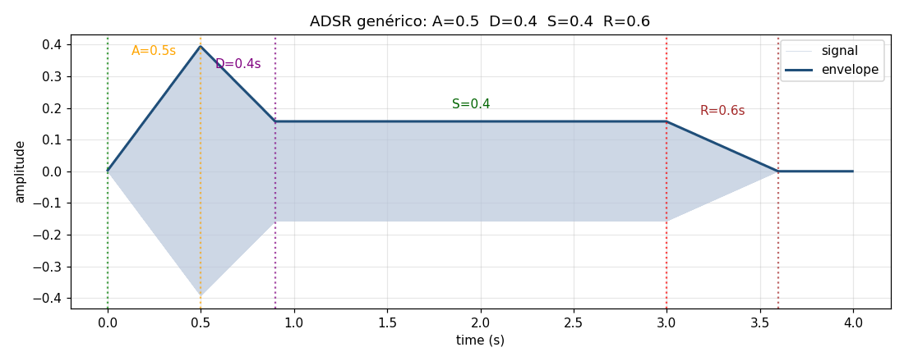
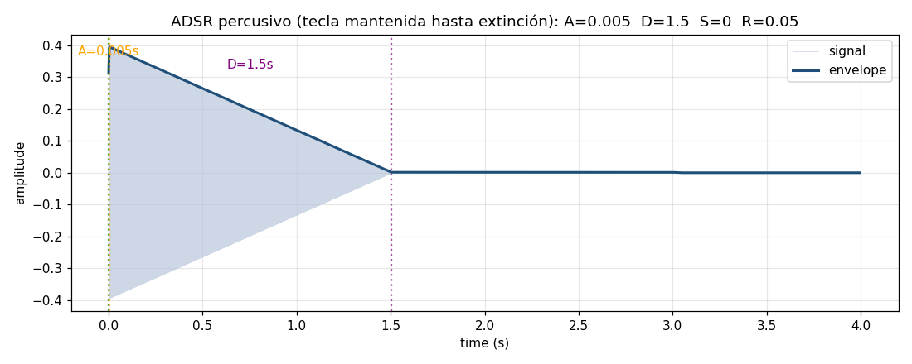
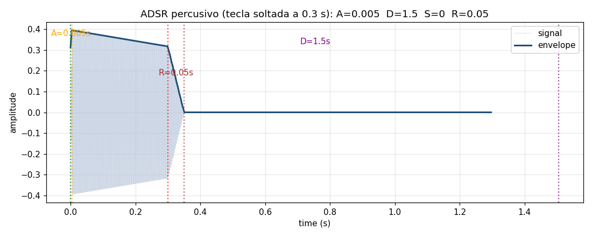
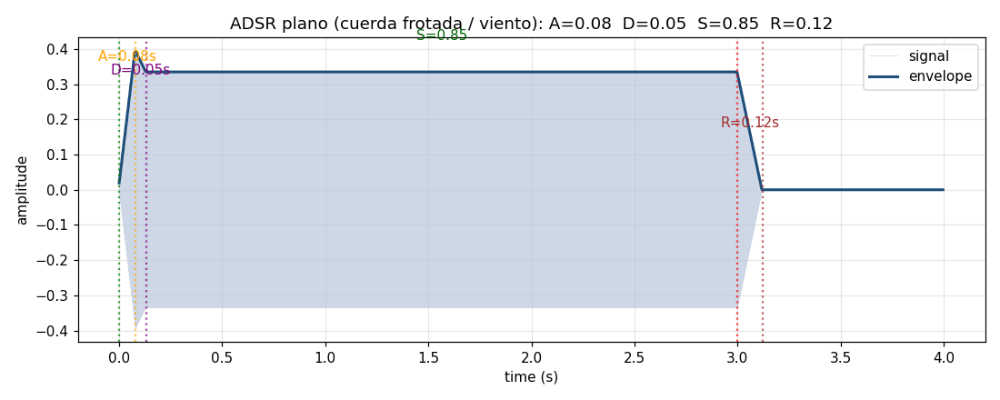
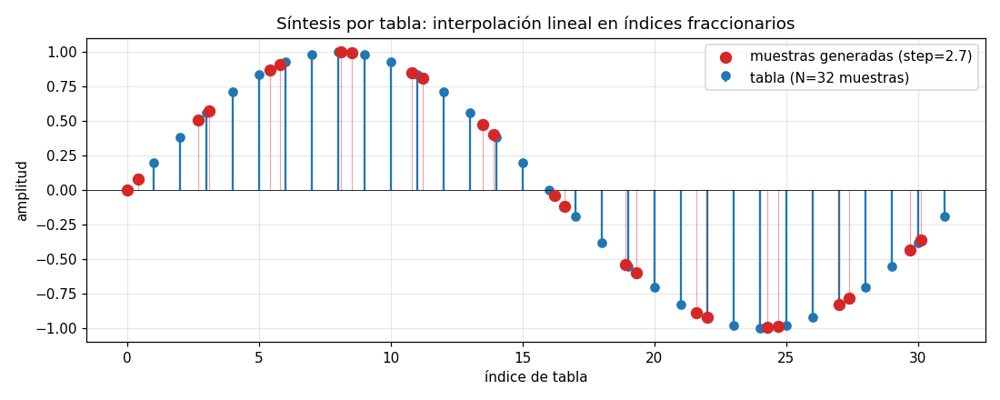
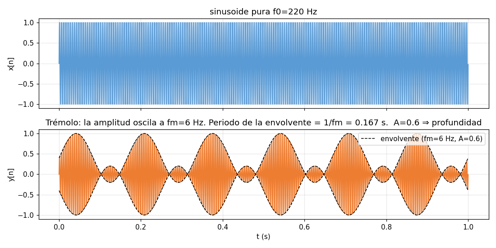
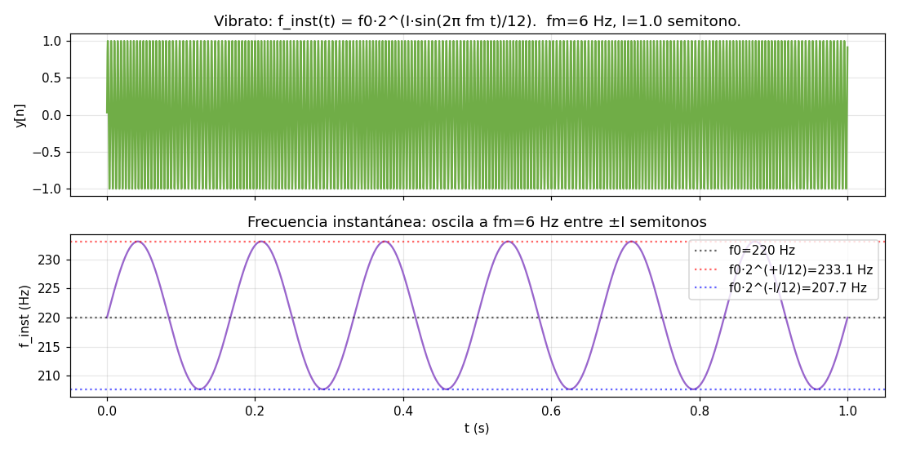
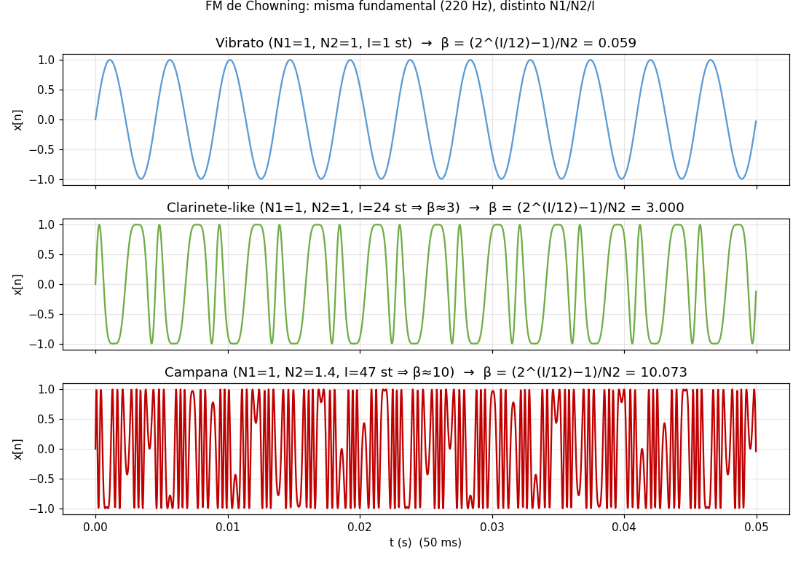

PAV - P5: síntesis musical polifónica
=====================================

Memoria de la práctica P5 — sintetizador musical polifónico.
Compilar con `make release` (instala `synth` en `~/PAV/bin/`).

Índice
------
1. [Envolvente ADSR](#envolvente-adsr)
2. [Instrumentos Dumb y Seno](#instrumentos-dumb-y-seno)
3. [Efectos sonoros](#efectos-sonoros)
4. [Síntesis FM](#síntesis-fm)
5. [Orquestación usando el programa synth](#orquestación-usando-el-programa-synth)


## Envolvente ADSR

Hemos generado cuatro configuraciones ADSR sobre el mismo instrumento
(`Seno`, sinusoide por tabla) para visualizar el funcionamiento de la curva.
Los `.orc`, `.sco` y `.wav` viven en [`work/adsr/`](work/adsr).

### 1. ADSR genérico — los cuatro parámetros bien visibles

```text
work/adsr/generic.orc:  Seno  ADSR_A=0.5; ADSR_D=0.4; ADSR_S=0.4; ADSR_R=0.6; N=1024;
work/adsr/long_note.sco:  una sola nota La4 mantenida durante 3 s
synth work/adsr/generic.orc work/adsr/long_note.sco work/adsr/generic.wav
```



Las líneas punteadas marcan los límites entre fases: el ataque alcanza el
máximo a los 0.5 s, la caída desciende hasta el nivel S=0.4 a los 0.9 s, el
mantenimiento se prolonga hasta soltar la tecla a los 3 s, y la liberación
termina 0.6 s después.

### 2. Instrumento percusivo — nota mantenida hasta su extinción

ADSR típico de un piano/guitarra: ataque casi instantáneo, caída lenta hasta
0 (no hay mantenimiento), liberación muy corta.

```text
work/adsr/percussive.orc:       ADSR_A=0.005; ADSR_D=1.5; ADSR_S=0; ADSR_R=0.05;
work/adsr/percussive_full.sco:  NoteOn → NoteOff tardío (la nota se ha apagado sola)
synth work/adsr/percussive.orc work/adsr/percussive_full.sco work/adsr/percussive_full.wav
```



### 3. Instrumento percusivo — nota cortada antes de extinguirse

El mismo instrumento con un NoteOff temprano (a los 0.3 s). El sonido
todavía está decayendo cuando se inicia la fase release, que lo lleva
abruptamente a cero en 0.05 s.

```text
work/adsr/percussive_cut.sco:  NoteOn → NoteOff a 0.3 s
synth work/adsr/percussive.orc work/adsr/percussive_cut.sco work/adsr/percussive_cut.wav
```



### 4. Instrumento plano (cuerda frotada / viento)

Ataque rápido (sin sobrecarga), mantenimiento alto y constante, liberación
también breve.

```text
work/adsr/plain.orc:  ADSR_A=0.08; ADSR_D=0.05; ADSR_S=0.85; ADSR_R=0.12;
synth work/adsr/plain.orc work/adsr/long_note.sco work/adsr/plain.wav
```




## Instrumentos Dumb y Seno

`InstrumentDumb` original recorre la tabla con un incremento entero,
independientemente del pitch (de ahí su nombre). Implementamos `Seno`
copiando `InstrumentDumb` y añadiendo dos mejoras:

1. **Cálculo del step en función de la nota MIDI**: `step = f0 · N / fs`,
   donde `f0 = 440·2^((note − 69)/12)`.
2. **Interpolación lineal** entre los dos valores de tabla adyacentes al
   índice fraccionario, para evitar la distorsión audible que introduce el
   redondeo del *nearest-neighbor*.

Código completo de [`src/instruments/seno.cpp`](src/instruments/seno.cpp):

```cpp
#include <math.h>
#include "seno.h"
#include "keyvalue.h"

using namespace upc;
using namespace std;

Seno::Seno(const std::string &param)
  : adsr(SamplingRate, param) {
  bActive = false;
  x.resize(BSIZE);

  KeyValue kv(param);
  int N;
  if (!kv.to_int("N", N))
    N = 1024;

  tbl.resize(N);
  float ph = 0.0f;
  float dph = 2.0f * (float) M_PI / (float) N;
  for (int i = 0; i < N; ++i) {
    tbl[i] = sinf(ph);
    ph += dph;
  }

  phase = 0.0f;
  step = 0.0f;
  A = 0.0f;
}

void Seno::command(long cmd, long note, long vel) {
  if (cmd == 9) {
    bActive = true;
    adsr.start();
    A = vel / 127.0f;
    float f0 = 440.0f * powf(2.0f, (note - 69) / 12.0f);
    step = f0 * (float) tbl.size() / (float) SamplingRate;
    phase = 0.0f;
  }
  else if (cmd == 8) { adsr.stop(); }
  else if (cmd == 0) { adsr.end(); }
}

const vector<float> & Seno::synthesize() {
  if (not adsr.active()) {
    x.assign(x.size(), 0);
    bActive = false;
    return x;
  }
  else if (not bActive)
    return x;

  const float N = (float) tbl.size();
  for (unsigned int i = 0; i < x.size(); ++i) {
    unsigned int i0 = (unsigned int) phase;
    unsigned int i1 = (i0 + 1) % tbl.size();
    float frac = phase - (float) i0;
    x[i] = A * (tbl[i0] + frac * (tbl[i1] - tbl[i0]));

    phase += step;
    while (phase >= N) phase -= N;
  }

  adsr(x);
  return x;
}
```

### Método de búsqueda en tabla

La frecuencia de la nota se traduce a un paso (no entero) con el que se
recorre la tabla: `step = f0 · N / fs`. La variable `phase` mantiene la
posición fraccionaria entre llamadas a `synthesize()`, garantizando la
continuidad de fase a través de bloques.

Para cada muestra se calcula `i0 = ⌊phase⌋`, `i1 = (i0+1) mod N` y
`frac = phase − i0`; el valor de salida es la **interpolación lineal**:

    x = tbl[i0] + frac · (tbl[i1] − tbl[i0])



Los puntos azules son los `N=32` valores almacenados en la tabla. Los
puntos rojos son las muestras que la síntesis devuelve con un `step=2.7`
(elegido pequeño para que sean apreciables) — la mayoría caen entre dos
muestras de la tabla, y son combinación lineal de las adyacentes.

### Síntesis por tabla externa: `InstrumentWavetable`

El método `command()` de [`src/instruments/instrument_wavetable.cpp`](src/instruments/instrument_wavetable.cpp)
sigue la misma idea pero con `step` calculado para que la tabla almacenada
(un ciclo de WAV de longitud L) se recorra una vez por periodo deseado:

```cpp
void InstrumentWavetable::command(long cmd, long note, long vel) {
  if (cmd == 9) {
    bActive = true;
    adsr.start();
    A = vel / 127.0f;
    phase = 0;
    if (tbl && !tbl->empty()) {
      double f0 = 440.0 * pow(2.0, (note - 69) / 12.0);
      // step = L · f0 / fs  ⇒ la tabla se recorre una vez por cada periodo de salida
      step = (double)tbl->size() * f0 / SamplingRate;
    }
  } else if (cmd == 8) {
    adsr.stop();
  } else if (cmd == 0) {
    adsr.end();
  }
}
```

Y `InstrumentSampler` añade una transposición `step = f0/ft` (donde `ft`
es la frecuencia a la que se grabó el sample) y detiene la nota cuando se
agotan las muestras o termina la ADSR.


## Efectos sonoros

### Trémolo y vibrato sobre una sinusoide

El **trémolo** multiplica la amplitud de la señal por un oscilador
de baja frecuencia (`fm`); `A` controla la profundidad de la modulación.



El **vibrato** modula la *frecuencia* de la señal: la frecuencia
instantánea oscila a `fm` Hz dentro de un rango de `±I` semitonos
respecto a `f0`.



### Efectos adicionales implementados

Más allá de `Tremolo` y `Vibrato`, hemos implementado cinco efectos en
[`src/effects/`](src/effects/):

| Efecto | Algoritmo (resumen) | Parámetros |
|---|---|---|
| `Distortion` | Soft-clipping: `y = tanh(drive·x) / tanh(drive)`. Mantiene los picos suaves a la vez que satura. | `drive` (def. 1.0) |
| `Flanger` | Línea de retardo circular con retardo variable (LFO) entre 0 y `depth` ms. Lectura con interpolación lineal en índices fraccionarios. Realimentación de `fb`. | `fm` (def. 0.5 Hz), `depth` (def. 3 ms), `fb` (def. 0.7) |
| `Reverb` | Schroeder: 4 filtros peine (1557 / 1617 / 1491 / 1422 muestras) en paralelo con realimentación `room_size` y paso bajo intra-comb `damp`, seguidos de 2 all-pass (556 / 441) en serie. Mezcla 70 % seco / 30 % húmedo. | `room_size` (def. 0.5), `damp` (def. 0.2) |
| `Wah` | Filtro bandpass biquad RBJ con frecuencia central modulada sinusoidalmente entre `fmin` y `fmax`. La factor de calidad `Q` controla la selectividad. | `fm` (def. 1.5 Hz), `fmin`/`fmax` (def. 400 / 2200 Hz), `Q` (def. 5) |
| `Chorus` | Igual estructura que Flanger pero con retardo medio mayor (∼20 ms), profundidad pequeña (∼5 ms) y *sin* realimentación. Mezcla seco/húmedo `mix`. | `fm` (def. 0.8 Hz), `delay` (def. 20 ms), `depth` (def. 5 ms), `mix` (def. 0.5) |

Los `.sco` de demostración están en [`work/ejemplos/`](work/ejemplos), todos
ellos basados en la escala de `doremi.sco` con el efecto correspondiente
activado en el primer tick. Para regenerar los `.wav`:

```sh
cd work/ejemplos
synth -e effects_all.orc dumb.orc doremi_distortion.sco doremi_distortion.wav
synth -e effects_all.orc dumb.orc doremi_flanger.sco    doremi_flanger.wav
synth -e effects_all.orc dumb.orc doremi_reverb.sco     doremi_reverb.wav
synth -e effects_all.orc dumb.orc doremi_wah.sco        doremi_wah.wav
synth -e effects_all.orc dumb.orc doremi_chorus.sco     doremi_chorus.wav
```

Contenido de `work/ejemplos/effects_all.orc`:

```text
1  Tremolo     fm=6;   A=0.2;
2  Vibrato     fm=6;   I=1.0;
3  Distortion  drive=5.0;
4  Flanger     fm=0.5; depth=3.0; fb=0.7;
5  Reverb      room_size=0.6; damp=0.2;
6  Wah         fm=1.5; fmin=400; fmax=2200; Q=5;
7  Chorus      fm=0.8; delay=20; depth=5; mix=0.5;
```


## Síntesis FM

Hemos creado dos instrumentos:

- [`InstrumentVibrato`](src/instruments/instrument_vibrato.cpp) — vibrato como
  modulación nativa de la frecuencia instantánea. Parámetros: `fm` (Hz), `I`
  (semitonos de variación máxima).
- [`InstrumentFM`](src/instruments/instrument_fm.cpp) — síntesis FM de
  Chowning configurable. Parámetros: `N1`, `N2` (ratios — `N2` permite no
  enteros para timbres inarmónicos), y **`I` expresado en semitonos**.

El parámetro `I` indica la excursión máxima de pitch en semitonos. El
constructor lo convierte al índice de modulación adimensional `β` que
necesita la fórmula de Chowning:

    Δf = f0 · (2^(I/12) − 1)        ← excursión de frecuencia en Hz
    β  = Δf / fm = (2^(I/12) − 1) / N2

```cpp
// fragmento de InstrumentFM::InstrumentFM
if (!kv.to_float("I",  I_st)) I_st = 2.0f;
if (!kv.to_float("N1", N1))   N1   = 1.0f;
if (!kv.to_float("N2", N2))   N2   = 1.0f;
beta = (powf(2.0f, I_st / 12.0f) - 1.0f) / N2;
```

La síntesis aplica modulación de fase (equivalente matemáticamente a la FM
con moduladora sinusoidal):

    x[n] = A · sin( θ_c[n] + β · sin(θ_m[n]) )
    θ_c[n+1] = θ_c[n] + 2π·N1·f0/fs
    θ_m[n+1] = θ_m[n] + 2π·N2·f0/fs

### Correspondencia entre N1, N2, I y la señal generada



- **Vibrato puro** (`N1=N2=1`, `I=1 st`): `β≈0.06`, la moduladora apenas
  desplaza la portadora, prácticamente una sinusoide con un ligero `f`
  oscilante a `fm`.
- **Clarinete** (`N1=N2=1`, `I=24 st`): `β=3`, aparecen 3 bandas laterales
  significativas a `f0 ± k·f0`. Como `N1:N2=1:1`, las bandas caen sobre
  múltiplos enteros de `f0` → timbre armónico.
- **Campana** (`N1=1`, `N2=1.4`, `I=47 st`): `β≈10`, espectro denso a `f0
  + k·1.4·f0`, ratio irracional → componentes inarmónicas, sonido tipo
  campana o gong.

### Demostración polifónica de los regímenes

```sh
synth work/fm_test.orc work/fm_test.sco work/fm_test.wav
```

`work/fm_test.orc` define 4 canales que ilustran cada régimen:
canal 1 = `InstrumentVibrato`, canales 2–4 = `InstrumentFM` con
configuraciones brass / bell / woody respectivamente.

### Clarinete y campana sobre `doremi.sco`

Parámetros y comandos:

```text
work/doremi/clarinete.orc:
  InstrumentFM  ADSR_A=0.08; ADSR_D=0.10; ADSR_S=0.80; ADSR_R=0.15;
                N1=1; N2=1; I=24;

work/doremi/campana.orc:
  InstrumentFM  ADSR_A=0.005; ADSR_D=2.5; ADSR_S=0.0; ADSR_R=0.5;
                N1=1; N2=1.4; I=47;

synth work/doremi/clarinete.orc work/doremi.sco work/doremi/clarinete.wav
synth work/doremi/campana.orc   work/doremi.sco work/doremi/campana.wav
```

El clarinete usa un ratio armónico (`N1:N2 = 1:1`) y una envolvente con
mantenimiento, lo que produce un timbre con cuerpo y sostenido. La campana
usa un ratio inarmónico (`N2 = 1.4`) y una envolvente percusiva con
release largo (`ADSR_R = 0.5 s`) para que cada toque resuene mientras
arranca el siguiente.


## Orquestación usando el programa synth

### *You've Got a Friend in Me* — Randy Newman

El score `samples/ToyStory_A_Friend_in_me.sco` usa dos canales: canal 1
para la melodía solista y canal 2 para el bajo. Hemos asignado a ambos
`InstrumentFM` con parámetros distintos:

```text
work/music/toystory.orc:
  1  InstrumentFM  ADSR_A=0.04; ADSR_D=0.10; ADSR_S=0.75; ADSR_R=0.12;
                   N1=1; N2=1; I=18;   ← solista (timbre con cuerpo, sostenido)
  2  InstrumentFM  ADSR_A=0.01; ADSR_D=0.35; ADSR_S=0.45; ADSR_R=0.10;
                   N1=1; N2=1; I=10;   ← bajo (ataque rápido, decay marcado)
```

Comando para renderizar:

```sh
synth work/music/toystory.orc samples/ToyStory_A_Friend_in_me.sco work/music/toystory.wav
```

(BPM y TPB por defecto: `-b 120 -t 120`.)

### Otras canciones del directorio `samples/`

También se pueden orquestar las restantes partituras del directorio
`samples/`; basta con definir un `.orc` con los instrumentos asignados a
cada canal y pasar el `.sco` correspondiente:

```sh
synth -e work/modulations.orc work/dumb.orc samples/Hawaii5-0.sco out.wav
synth work/doremi/clarinete.orc samples/The_Christmas_Song_Lennon.sco out.wav
```

> NOTA: el sample WAV generado para ToyStory en `work/music/toystory.wav`
> dura ~85 s. Conviene revisarlo a volumen moderado para evitar
> ruidos/clipping y proteger los oídos de quien corrija la práctica.
